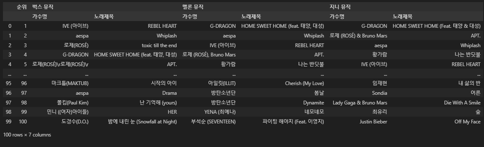

## 음악 차트 크롤링 및 데이터 통합 프로젝트

### 📝 프로젝트 소개

멜론, 지니뮤직, 벅스의 실시간 TOP 100 차트를 크롤링하고, 데이터를 통합하여 하나의 데이터셋으로 구성한 프로젝트입니다.

---

### 🛠 사용 기술

- Python
- BeautifulSoup4: 웹 크롤링
- Pandas: 데이터 처리 및 통합
- time: 페이지 로딩 제어

### ⚙ 주요 기능

#### 크롤링

- 멜론 TOP 100 차트 수집
- 지니뮤직 TOP 100 차트 수집 (페이지 분할 처리)
- 벅스 TOP 100 차트 수집

#### 데이터 처리

- 개별 차트 데이터 CSV 저장
- 3개 차트 데이터 통합
- 멀티인덱스를 활용한 순위 정렬
- 최종 통합 데이터 CSV 저장

### 📁 결과물

- 멜론 TOP 100 CSV
- 지니뮤직 TOP 100 CSV
- 벅스 TOP 100 CSV
- 통합 차트 CSV
  
